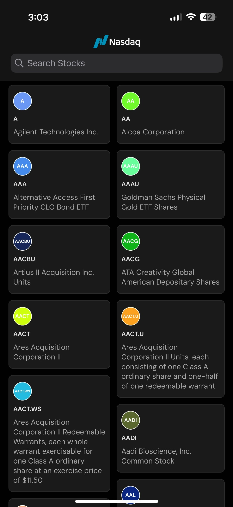
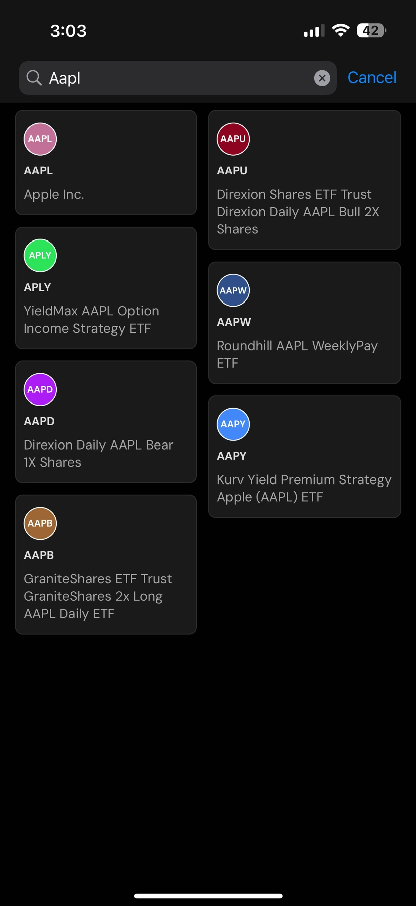
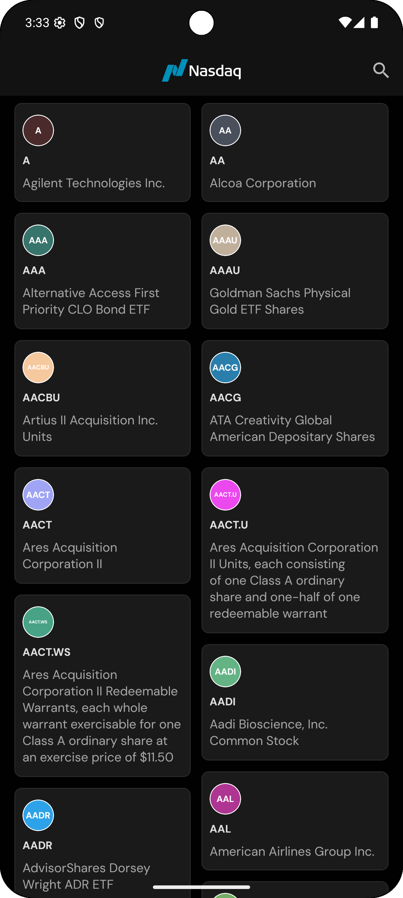
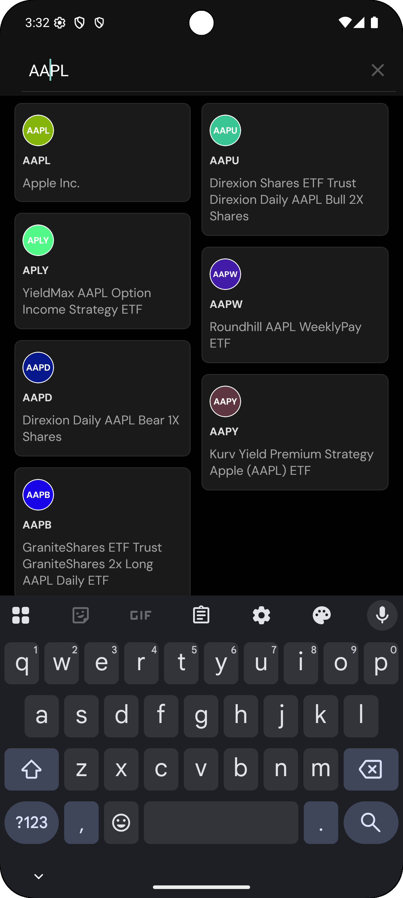

# 📈 Stock Market App


A beautifully designed stock market application built with React Native that allows users to explore, search, and view real-time stock data powered by the Polygon.io API.

## 📱 App Preview

### iOS:

|                Splash Screen                 |                 Explore Stocks                 |                Search Stocks                 |
| :------------------------------------------: | :--------------------------------------------: | :------------------------------------------: |
|  |  |  |

### Android:

|                    Splash Screen                    |                    Explore Stocks                     |                    Search Stocks                    |
| :-------------------------------------------------: | :---------------------------------------------------: | :-------------------------------------------------: |
|  |  |  |

## 📦 Installation

- TestFlight: [Download](https://testflight.apple.com/join/fYPXAdcQ)
- APK: [Download](https://github.com/stringsaeed/StockMarketApp/releases/download/v1.0.0/app-release.apk)

## ✨ Features

- **Splash Screen**: Elegant onboarding experience with NASDAQ branding
- **Stock Exploration**: Browse and discover stocks with real-time data
- **Search Functionality**: Find specific stocks with debounced search
- **Real-time Data**: Integration with Polygon.io API for market data
- **Responsive UI**: Beautiful UI components with seamless animations
- **Bottom Sheet**: Interactive bottom sheet for detailed stock information
- **Loading States**: Smooth Lottie animations for loading and error states
- **Comprehensive Testing**: Unit, integration, and component tests

## 🛠️ Technology Stack

- **Framework**: React Native 0.78.0
- **Language**: TypeScript 5.0.4
- **State Management**: React Query (TanStack Query)
- **Navigation**: React Navigation v7
- **API Integration**: Axios
- **UI Components**:
  - React Native Reanimated
  - React Native Gesture Handler
  - Bottom Sheet
  - Flash List (for optimized lists)
  - Lottie for animations
- **Testing**: Jest with React Testing Library
- **Code Quality**:
  - ESLint with custom configuration
  - Prettier
  - Commit linting
  - Lefthook for Git hooks

## 🚀 Getting Started

### Prerequisites

- Node.js >= 18
- Ruby (for CocoaPods)
- XCode (for iOS development)
- Android Studio (for Android development)
- JDK 11 or newer

### Installation

1. Clone the repository

   ```bash
   git clone git@github.com:stringsaeed/StockMarketApp.git
   cd StockMarketApp
   ```

2. Install JavaScript dependencies

   ```bash
   bun install
   ```

3. Install iOS dependencies
   ```bash
   bundle install
   bundle exec pod install --project-directory=ios
   ```

## 🏃‍♂️ Running the App

### Start Metro server

```bash
bun start
```

### Run on Android

```bash
bun run android
```

### Run on iOS

```bash
bun run ios
```

## 🧪 Testing

The project includes comprehensive test coverage using Jest and React Testing Library:

```bash
# Run all tests
bun run test

# Watch mode
bun run test:watch

# Generate coverage report
bun run test:coverage
```

## 📁 Project Structure

```
src/
├── assets/           # Static assets (fonts, images, animations)
├── components/       # Reusable UI components
├── features/         # Feature-based modules
│   └── stocks/       # Stock-related components and logic
├── hooks/            # Custom React hooks
├── navigation/       # Navigation configuration
├── screens/          # App screens
├── services/         # API services
└── types/            # TypeScript type definitions
```

## 🧩 Architecture

This application follows a feature-based architecture with clean separation of concerns:

- **Presentational Components**: UI components without business logic
- **Container Components**: Components that manage data and state
- **Custom Hooks**: Encapsulate and reuse stateful logic
- **API Services**: Handle external API communication
- **Types**: Strong TypeScript typing throughout the application

## 📱 Features Implementation

### Stock Exploration

Browse through a list of stocks with real-time data from Polygon.io API. The implementation uses Flash List for optimal performance with large datasets.

### Search Functionality

Search stock symbols and names with debounced input to minimize API calls while typing.

### Detailed Stock Information

View detailed information about a stock using an interactive bottom sheet.

## 🔗 API Integration

The app uses the Polygon.io API for stock market data. The API integration is handled through the `polygon.ts` service.

## 📘 Development Guidelines

- Follow the existing code style and organization
- Write tests for new features
- Use the existing component structure
- Follow commit message conventions (conventional commits)

## 🤝 Contributing

1. Fork the repository
2. Create your feature branch (`git checkout -b feature/amazing-feature`)
3. Commit your changes (`git commit -m 'feat: add some amazing feature'`)
4. Push to the branch (`git push origin feature/amazing-feature`)
5. Open a Pull Request

## 📄 License

This project is licensed under the MIT License - see the LICENSE file for details.

## 👨‍💻 Author

This Stock Market App was developed as an interview task demonstration.

## 🙏 Acknowledgments

- [Polygon.io](https://polygon.io/) for the stock market data API
- [React Native](https://reactnative.dev/) community for the amazing framework
- All the open-source libraries that made this project possible

## 🚀 Release Process

The app uses an automated release process to streamline version management and deployment:

### Automated Release Features

1. **Version Management**

   - Automatically updates version numbers across:
     - `package.json`
     - iOS project (version and build number)
     - Android build.gradle (versionCode and versionName)

2. **GitHub Releases**
   - Creates GitHub releases with auto-generated release notes from commit history
   - Automatically builds and attaches Android APK to the release

### How to Create a Release

To create a new release, run one of the following commands:

```bash
# Patch release (1.0.0 -> 1.0.1)
bun release:patch

# Minor release (1.0.0 -> 1.1.0)
bun release:minor

# Major release (1.0.0 -> 2.0.0)
bun release:major

# Custom version
bun release -- 1.2.3
```

The release process will:

1. Lint the code
2. Bump version numbers in all necessary files
3. Create a git tag
4. Push changes and tag to GitHub
5. Create a GitHub release with auto-generated release notes
6. Trigger a GitHub Actions workflow to build and attach the Android APK

### CI/CD Pipeline

When a new GitHub release is created, a GitHub Actions workflow automatically:

1. Builds the Android APK
2. Uploads the APK as an asset to the corresponding GitHub release
